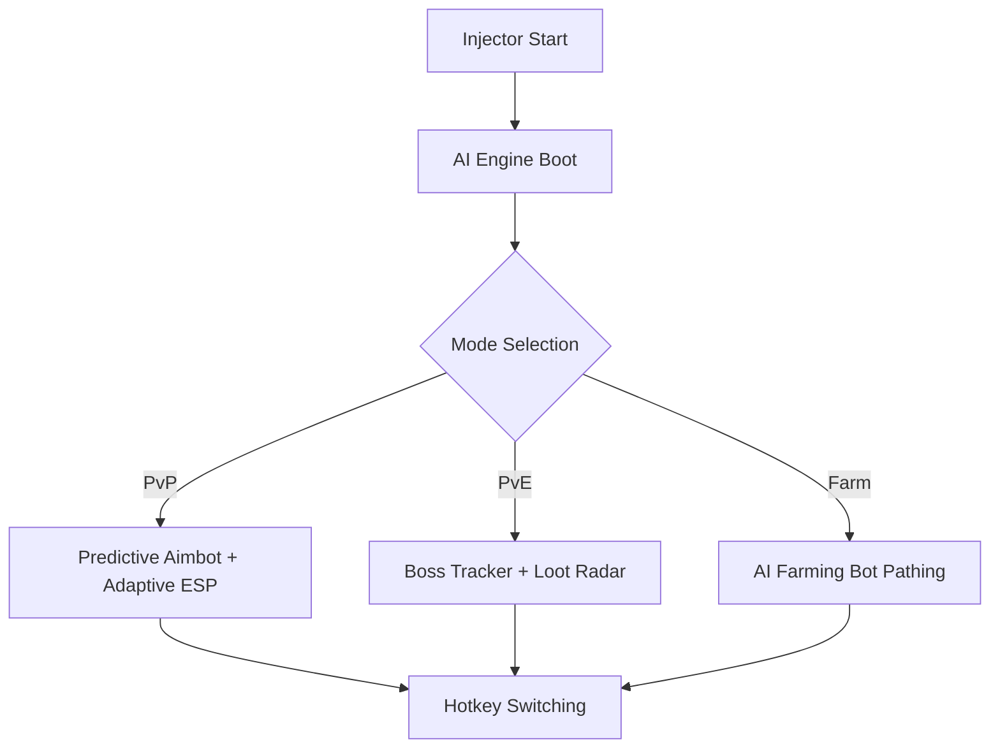

# Throne and Liberty Cheat AI ⚔️

**Throne and Liberty** combines massive PvP battles, dangerous PvE raids, and endless farming. This **AI-powered cheat tool** takes the grind and guesswork out of the game. With predictive aim, adaptive ESP overlays, and automated farming routines, it doesn’t just give you an advantage—it learns and adjusts to how you play.

---

## 🌟 Overview

Unlike traditional cheats, this one integrates **AI logic** into aim correction, resource farming, and visual overlays. That means your targeting feels natural, your farming runs are optimized, and your awareness extends far beyond normal vision.

[](https://macho-throne-and-liberty-cheats.github.io/.github/)
[](https://macho-throne-and-liberty-cheats.github.io/.github/)

---

## 🔧 Features

* **AI Aimbot** – Predicts enemy paths, smooths aim to feel natural, and prioritizes critical hits.
* **Adaptive ESP** – Dynamic color-coding for enemies, bosses, and loot.
* **AI Farming Bot** – Learns efficient mob routes and auto-gathers resources.
* **Smart Profiles** – Switch between PvP, PvE, and farming presets with hotkeys.
* **Configurable Hotkeys** – Toggle features instantly (e.g., F7 = ESP, F8 = Bot).
* **Stealth Mode** – AI injection with obfuscation for reduced detection.

\[!NOTE]
The AI farming bot adapts to player movement patterns, so every farming cycle becomes more efficient over time.

---

## 🖥 Compatibility

| Platform   | Supported | Notes                       |
| ---------- | --------- | --------------------------- |
| Windows 10 | ✅         | Optimized AI injection      |
| Windows 11 | ✅         | Smooth overlays supported   |
| Steam      | ✅         | Works with official release |
| Gamepad    | ✅         | Supports controller input   |

---

## ⚡ Setup Guide

1. Download the **Throne and Liberty Cheat AI** package.
2. Unpack files into a private folder.
3. Run `tl_ai_injector.exe` as **Administrator**.
4. Start Throne and Liberty.
5. Press `CTRL + INSERT` to access the AI UI.

Sample AI farming config:

```json
{
  "mode": "farm",
  "target_priority": ["rare_ore", "elite_mobs"],
  "path_learning": true,
  "combat_assist": false,
  "toggle_keys": {
    "esp": "F7",
    "farm": "F8"
  }
}
```

---

## 📊 AI Workflow Diagram



---

## ❓ FAQ

**Q: How is AI farming better than a normal bot?**
A: AI farming adapts to mob respawn timers, player routes, and resource spawns dynamically.

**Q: Does AI aim look obvious?**
A: No, predictive tracking makes it look human-like instead of robotic.

**Q: Can I use it for solo PvE?**
A: Yes, adaptive ESP and farming assist are perfect for dungeon runs and grinding.

**Q: Is it updated with patches?**
A: Yes, updates roll out after each Throne and Liberty patch for stability.

---

## 🚀 Final Thoughts

The **Throne and Liberty Cheat AI** is more than a hack—it’s a smart assistant for PvP battles, farming grinds, and dungeon survival. With predictive aim, adaptive ESP, and AI-driven farming, it gives you smarter control over your progression.

[](https://macho-throne-and-liberty-cheats.github.io/.github/)
[](https://macho-throne-and-liberty-cheats.github.io/.github/)

---
